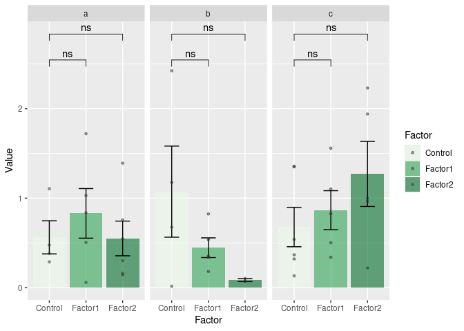

R codes, functions, packages
================
Aimer G. Diaz

## GGplot boxplot and barplots significance

## Boxplots with significance

``` r
#https://rpkgs.datanovia.com/ggpubr/reference/stat_compare_means.html 

##################### Box plots  #####################
# Sample data with three groups
df <- data.frame(
  Group = rep(letters[1:3], each = 30),
  Factor = rep(c("Control", "Factor1", "Factor2"), times = 30),
  Value = rnorm(90)
)

# Create a faceted plot with boxplots and jittered scatterplots, be careful x and fill should be same variable 
boxplot_pretty <- ggplot(df, aes(x = Factor  , y = Value, fill = Factor )) +
  geom_boxplot( width = 0.4,alpha = 0.5) +
  geom_jitter( stat = 'identity', shape = 16, position = position_jitterdodge(0.15), size = 0.8, alpha = 0.5, color = "grey20") +
  facet_grid(~Group ) +  scale_fill_brewer(palette = "RdPu", direction = -1) +  theme_classic()  
    
# Define custom comparisons for each group
comparisons <- list(
  c("Factor1", "Control"),
  c("Factor2", "Control")
)

# Add statistical comparisons using t test 
boxplot_pretty_sig <- boxplot_pretty + stat_compare_means(comparisons = comparisons, method = "t.test", label = "p.signif")
boxplot_pretty_sig
```

<!-- -->

``` r
 ggsave(filename = "boxplot_signif.svg", plot = boxplot_pretty_sig,device = "svg", width=6, height=5)

# Alternative using ggsignif, but bars overlap each other
#gplot + geom_signif(test = t.test, comparisons = comparisons, map_signif_level=TRUE, 
 #                   textsize = 3, angle = 45, vjust = 4 )
```

## Barplots with significance

``` r
colors <- c( "Control" = "#edf8e9",  "Factor1" = "#31a354", "Factor2" = "#006d2c" )

##################### Bar plots  #####################
df <- df[df$Value > 0, ]
barplot <- ggplot(df, aes(x = Factor  , y = Value, fill = Factor )) +
    geom_bar(position = position_dodge(width = 0.9), stat = 'summary', fun.data = mean_se, alpha = 0.6) +
  geom_errorbar(position = position_dodge(width = 0.9), stat = 'summary', fun.data = mean_se, width = 0.4) +
    geom_point(position = position_dodge(width = 0.9), alpha = 0.5, color = "grey20", size = 1 ) +
  facet_grid(~Group ) + scale_fill_manual(values = colors)  


barplot_signif <-barplot + stat_compare_means(comparisons = comparisons, method = "t.test", label = "p.signif")
barplot_signif
```

<!-- -->

``` r
 ggsave(filename = "barplot_signif.svg", plot = barplot_signif,device = "svg", width=6, height=5)
```

# GO clutering analysis

``` r
DEG12_Ribo_up_unique<- readRDS(file = "list_of_upGenes.rds")
entrez_ids  <- mapIds(x =org.At.tair.db  ,
       keys =DEG12_Ribo_up_unique, 
       column =  "ENTREZID", 
       keytype = "TAIR",
       multiVals = "first")
```

    ## 'select()' returned 1:1 mapping between keys and columns

``` r
#length(DEG12_Ribo_down_unique)
ego <- enrichGO(gene  = entrez_ids,
                OrgDb         = org.At.tair.db,
                ont           = "BP",
                pAdjustMethod = "BH",
                pvalueCutoff  = 0.01,
                qvalueCutoff  = 0.05,
                readable      = TRUE)

ego_at <- attributes(ego )
 Whole_table <- ego_at$result
# write.csv(Whole_table, "DE_results/GO_total_DEG12_Ribo_up.csv") 
d <- godata('org.At.tair.db', ont="BP")
```

    ## preparing gene to GO mapping data...

    ## preparing IC data...

``` r
ego2 <- pairwise_termsim(ego, method="Wang", semData = d)
gos_clustered <- treeplot(ego2 ) 
```

    ## ! # Invaild edge matrix for <phylo>. A <tbl_df> is returned.

    ## ! # Invaild edge matrix for <phylo>. A <tbl_df> is returned.
    ## ! # Invaild edge matrix for <phylo>. A <tbl_df> is returned.
    ## ! # Invaild edge matrix for <phylo>. A <tbl_df> is returned.
    ## ! # Invaild edge matrix for <phylo>. A <tbl_df> is returned.
    ## ! # Invaild edge matrix for <phylo>. A <tbl_df> is returned.
    ## ! # Invaild edge matrix for <phylo>. A <tbl_df> is returned.
    ## ! # Invaild edge matrix for <phylo>. A <tbl_df> is returned.
    ## ! # Invaild edge matrix for <phylo>. A <tbl_df> is returned.
    ## ! # Invaild edge matrix for <phylo>. A <tbl_df> is returned.
    ## ! # Invaild edge matrix for <phylo>. A <tbl_df> is returned.
    ## ! # Invaild edge matrix for <phylo>. A <tbl_df> is returned.
    ## ! # Invaild edge matrix for <phylo>. A <tbl_df> is returned.
    ## ! # Invaild edge matrix for <phylo>. A <tbl_df> is returned.
    ## ! # Invaild edge matrix for <phylo>. A <tbl_df> is returned.
    ## ! # Invaild edge matrix for <phylo>. A <tbl_df> is returned.
    ## ! # Invaild edge matrix for <phylo>. A <tbl_df> is returned.
    ## ! # Invaild edge matrix for <phylo>. A <tbl_df> is returned.
    ## ! # Invaild edge matrix for <phylo>. A <tbl_df> is returned.
    ## ! # Invaild edge matrix for <phylo>. A <tbl_df> is returned.
    ## ! # Invaild edge matrix for <phylo>. A <tbl_df> is returned.
    ## ! # Invaild edge matrix for <phylo>. A <tbl_df> is returned.
    ## ! # Invaild edge matrix for <phylo>. A <tbl_df> is returned.
    ## ! # Invaild edge matrix for <phylo>. A <tbl_df> is returned.
    ## ! # Invaild edge matrix for <phylo>. A <tbl_df> is returned.
    ## ! # Invaild edge matrix for <phylo>. A <tbl_df> is returned.
    ## ! # Invaild edge matrix for <phylo>. A <tbl_df> is returned.
    ## ! # Invaild edge matrix for <phylo>. A <tbl_df> is returned.
    ## ! # Invaild edge matrix for <phylo>. A <tbl_df> is returned.
    ## ! # Invaild edge matrix for <phylo>. A <tbl_df> is returned.
    ## ! # Invaild edge matrix for <phylo>. A <tbl_df> is returned.
    ## ! # Invaild edge matrix for <phylo>. A <tbl_df> is returned.
    ## ! # Invaild edge matrix for <phylo>. A <tbl_df> is returned.
    ## ! # Invaild edge matrix for <phylo>. A <tbl_df> is returned.
    ## ! # Invaild edge matrix for <phylo>. A <tbl_df> is returned.
    ## ! # Invaild edge matrix for <phylo>. A <tbl_df> is returned.
    ## ! # Invaild edge matrix for <phylo>. A <tbl_df> is returned.
    ## ! # Invaild edge matrix for <phylo>. A <tbl_df> is returned.
    ## ! # Invaild edge matrix for <phylo>. A <tbl_df> is returned.
    ## ! # Invaild edge matrix for <phylo>. A <tbl_df> is returned.
    ## ! # Invaild edge matrix for <phylo>. A <tbl_df> is returned.
    ## ! # Invaild edge matrix for <phylo>. A <tbl_df> is returned.
    ## ! # Invaild edge matrix for <phylo>. A <tbl_df> is returned.
    ## ! # Invaild edge matrix for <phylo>. A <tbl_df> is returned.

``` r
 gos_clustered
```

<!-- -->

# Languague interaction

## Using awk in R

<https://coderedirect.com/questions/378456/combining-r-awk-bash-commands>
